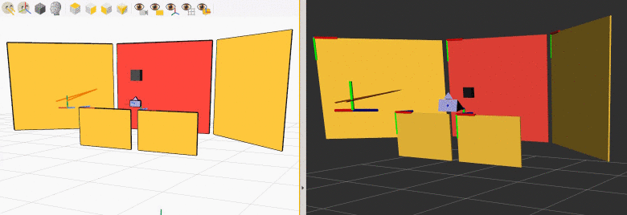
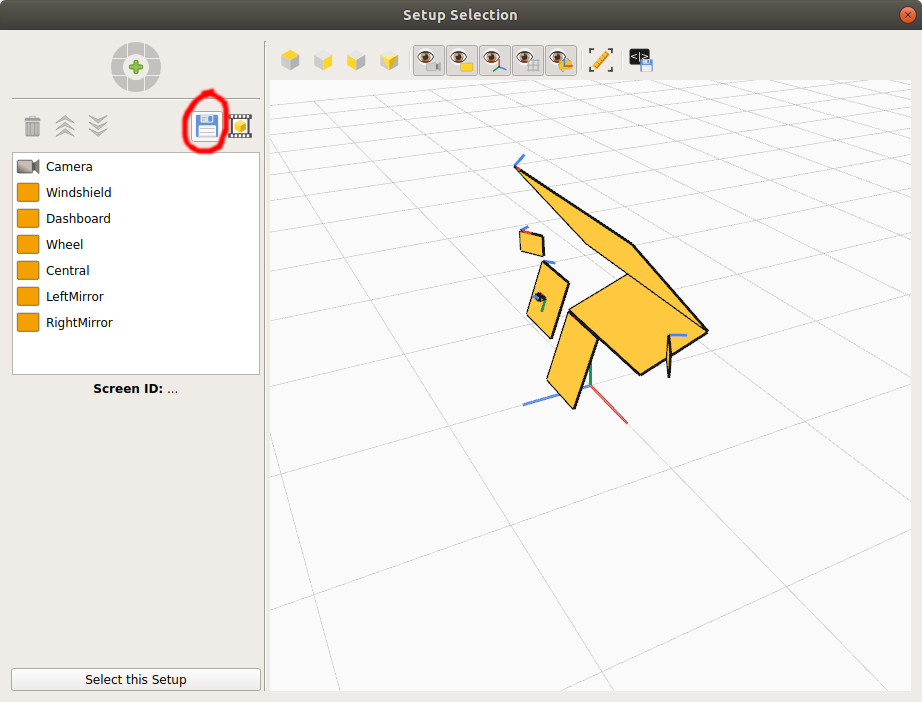
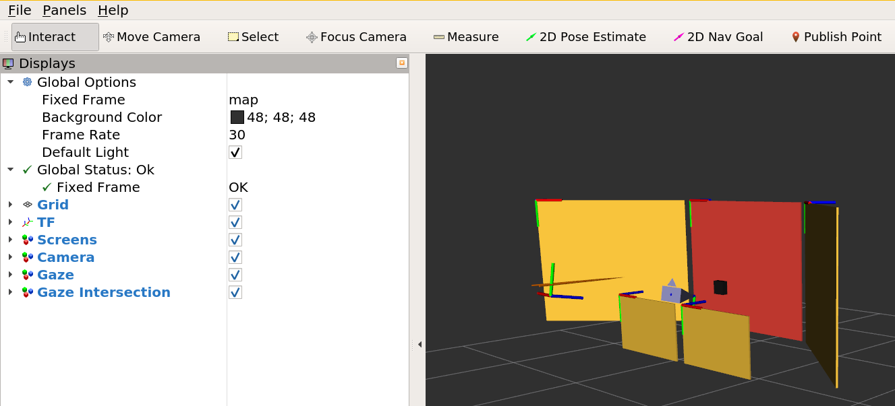
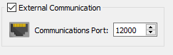

# Eyeware ROS utilities

## GazeSense ROS bridge

The GazeSense ROS bridge exposes 3D eye tracking data from the GazeSense application into the Robot Operating System (ROS).

GazeSense is an application developed by Eyeware Tech SA (http://www.eyeware.tech) that provides real-time 3D eye tracking by relying on consumer 3D sensors. GazeSense allows to define virtual 3D objects of the environment, and measure the attention of people towards those objects.

The GazeSense ROS bridge publishes 3D eye tracking data on ROS topics. In addition, this tracking data can be visualized in Rviz:

<figure>
  
  <figcaption>Left: GazeSense eye tracking. Right: ROS bridge eye tracking.
  <p>Both visualizations show the position of a camera (purple glyph) and a tracked person's estimated gaze (orange rays), as the person is looking at different areas of the environment (yellow screens).
  <p>The area that is being fixated at a given instant is highlighted in red. The black cube represents the point that the person is looking at.</figcaption>
</figure>

## Requirements

The GazeSense ROS bridge was developed and tested on a system with:
* Ubuntu 18.04
* GazeSense (graphical application) 2.1.0
* ROS Melodic with Python 3 support

## Installation

In the rest of this guide, we will assume that:
* GazeSense (graphical application) is uncompressed in `~/gazesense/`
* the ROS workspace is located in `~/gazesense_ws/`

However, the two paths can be adjusted as desired.

### GazeSense

Uncompress GazeSense (graphical application) in `~/gazesense`. In particular, the directory `~/gazesense/API/python` should exist.

### ROS Melodic and Python 3

First, we install ROS Melodic as described in the [ROS installation page](http://wiki.ros.org/melodic/Installation/Ubuntu):

```bash
sudo sh -c 'echo "deb http://packages.ros.org/ros/ubuntu $(lsb_release -sc) main" > /etc/apt/sources.list.d/ros-latest.list'
sudo apt-key adv --keyserver 'hkp://keyserver.ubuntu.com:80' --recv-key C1CF6E31E6BADE8868B172B4F42ED6FBAB17C654
sudo apt update
sudo apt install ros-melodic-desktop-full
```

The Python API of GazeSense requires Python 3.6, but ROS Melodic ships with Python 2 by default. Therefore, we need to install the Python 3 version of ROS Melodic. We follow the instructions from
[here](https://dhanoopbhaskar.com/blog/2020-05-07-working-with-python-3-in-ros-kinetic-or-melodic/):

```bash
sudo apt install python3-pip python3-all-dev python3-rospkg
# The previous command might uninstall parts of ROS Melodic. We now restore it:
sudo apt install ros-melodic-desktop-full --fix-missing
sudo apt install python3-numpy
sudo apt install ros-melodic-ddynamic-reconfigure
```

### Compilation of the ROS workspace

We create the ROS workspace in `~/gazesense_ws/` in this way:

```bash
source /opt/ros/melodic/setup.bash
mkdir -p ~/gazesense_ws/src/
catkin_init_workspace ~/gazesense_ws/src/
git -C ~/gazesense_ws/src/ clone https://github.com/eyeware/eyeware-ros
catkin_make -C ~/gazesense_ws/
```

Successful result:

```bash
...
[100%] Built target gazesense_msgs_generate_messages_cpp
[100%] Built target gazesense_msgs_generate_messages_py
[100%] Built target gazesense_msgs_generate_messages_eus
Scanning dependencies of target gazesense_msgs_generate_messages
[100%] Built target gazesense_msgs_generate_messages
```

## How to use

Below, we first describe how to run a complete demo (including graphical visualization). Then, we will go over specific components (publisher, subscriber) and their available options.

### Complete demo quick start

Assuming that everything is installed and compiled as described in the [Installation](#Installation) section, **run GazeSense** in one terminal:

```bash
cd ~/gazesense/
./run_GazeSense.sh
```

Within GazeSense, it is useful to export the 3D Setup description file on the disk as a JSON file. This files encodes the geometric description of the environment, such as the locations and sizes of possible attention targets. We can export the file with this button:



Let us assume the file is exported to the location `/PATH/TO/SETUP.json`.

Finally, within GazeSense, tick the "External Communication" box with port 12000, and press "Connect". The application will start tracking the person's head and gaze.

Then, in another terminal, run:

```bash
source ~/gazesense_ws/devel/setup.bash
export PYTHONPATH=$HOME/gazesense/API/python:$PYTHONPATH
roslaunch gazesense_bridge demo.launch port:=12000 host:=localhost setup:=/PATH/TO/SETUP.json
```

where `setup:=/PATH/TO/SETUP.json` points to the 3D Setup description file (geometric description of the environment) currently being used by GazeSense for its tracking, exported as described before.

In RViz, we can trigger the display of the following elements:

* [TF trees](http://wiki.ros.org/tf)
* screens (topic `/gazesense/screens`)
* camera glyph (topic `/gazesense/cameras`)
* gaze rays (topic `/gazesense/gaze`)
* gaze intersection point on the screen (topic `/gazesense/gaze_intersection`)

Example:



Next, we will describe the individual parts that make up the complete demo. 

### Simple publication of ROS messages

We run the ROS bridge publisher of head and eye tracking information as follows:

```bash
source ~/gazesense_ws/devel/setup.bash
export PYTHONPATH=$HOME/gazesense/API/python:$PYTHONPATH
roslaunch gazesense_bridge gazesense_bridge.launch
```

Messages are published under topic
`/gazesense_bridge/persons`.

### Publication of ROS messages with custom options

Optionally, we can run the ROS bridge publisher by specifying the following options:

```bash
source ~/gazesense_ws/devel/setup.bash
export PYTHONPATH=$HOME/gazesense/API/python:$PYTHONPATH
roslaunch gazesense_bridge gazesense_bridge.launch port:=12000 host:=localhost root:=Camera setup:=/PATH/TO/SETUP.json
```

where:

* `host` and `port` define the network configuration where the ROS bridge receives tracking data from the GazeSense application. The port number must match the one specified in the "External Communication" panel in GazeSense:
 
 <figure>
  
</figure>

* `setup:=/PATH/TO/SETUP.json` loads the 3D Setup description file from GazeSense (geometric description of environment screens and camera, exported as described before), and publishes the [TF tree](http://wiki.ros.org/tf) of the screens and camera
* `root:=Camera` indicates which screen or camera should be used as the TF tree root.

### Subscribe GazeSense ROS topic

We provide a [simple
listener](gazesense_bridge/scripts/gazesense_listener.py) to show how to subscribe to the GazeSense ROS API and receive tracking data from it.

In a terminal we run the GazeSense bridge publisher:

```bash
source ~/gazesense_ws/devel/setup.bash
export PYTHONPATH=$HOME/gazesense/API/python:$PYTHONPATH
roslaunch gazesense_bridge gazesense_bridge.launch
```

In another terminal, we run the listener:

```bash
source ~/gazesense_ws/devel/setup.bash
export PYTHONPATH=$HOME/gazesense/API/python:$PYTHONPATH
rosrun gazesense_bridge gazesense_listener.py
```

This simple listener demo subscribes to `/gazesense/persons` and prints the
ID of the screen that the user is looking at.

### Publish the RViz markers

RViz markers permit to show elements such as screen rectangles, reference frame markers, intersection points, head and gaze lines of the user via

To display these markers, run:
```bash
source ~/gazesense_ws/devel/setup.bash
export PYTHONPATH=$HOME/gazesense/API/python:$PYTHONPATH
roslaunch gazesense_bridge gazesense_bridge.launch root:=Camera with_markers:=1 setup:=/PATH/TO/SETUP.json
```
where
* `with_markers:=1` activates markers (they are off by default)
* `setup:=/PATH/TO/SETUP.json` loads the 3D Setup description file from GazeSense (geometric description of environment screens and camera, exported as described before). Make sure it is the same as the one currently used by GazeSense.

The following markers are published:

- screens (topic `/gazesense/screens`)
- camera (topic `/gazesense/cameras`)
- gaze rays (topic `/gazesense/gaze`)
- gaze intersection point on the screen (topic `/gazesense/gaze_intersection`)

### Integrate GazeSense ROS with a custom `.launch` file

We can customize the way in which GazeSense ROS bridge and its options are run from file
`launch/demo.launch`:
```
  <include
      file="$(find gazesense_bridge)/launch/gazesense_bridge.launch" >
      <arg name="port"          value="$(arg port)" />
      <arg name="host"          value="$(arg host)" />
      <arg name="setup"         value="$(arg setup)" />
      <arg name="root"          value="World" />
      <arg name="with_markers"  value="true" />
  </include>
```

In addition, we can connect the GazeSense TF tree to any other TF tree (e.g., positioned on a robot part) as follows:
```
  <node
      pkg="tf2_ros"
      type="static_transform_publisher"
      name="gazesense_broadcaster"
      args="0 0 0 0 0 0 1 YOUR_NODE GAZESENSE_ROOT" >
  </node>
```

For instance, if the camera is placed on a ROS node called `robot_hand`, we can use:
```
# Argument for gazesense_bridge
<arg name="root"          value="Camera" />
# Argument for transform
args="0 0 0.05 0 0 0 1 robot_hand Camera"
```

Depending on which root is more convenient to use in a custom application, one can use either "Camera", or "World", or any of the other screens as `GAZESENSE_ROOT`.

## Further information, known issues and limitations

The GazeSense ROS bridge works by sending data in one direction, from GazeSense (graphical application) to ROS.

This means that GazeSense app is the part responsible for selecting the input camera hardware type, as well as managing the 3D Setup environment.
The ROS bridge receives tracking data from GazeSense app over a network connection.
If you wish to change the camera input type or the location of the camera and attention screens in the 3D Setup, change those properties in GazeSense app first, then restart the ROS bridge so that it receives the updated information.

### Sharing the camera input with another program

It is currently not possible to use a single camera as input to 1) GazeSense ROS bridge and 2) another program simultaneously.
GazeSense (the graphical application) takes exclusive control of the camera driver.

### Visualization of RGB image or point cloud

Currently, the RGB image or point cloud from the camera cannot be displayed in RViz.

The reason is that the camera driver is started and managed by the GazeSense application, not by the ROS bridge.
The ROS bridge receives tracking data from GazeSense (this data does not include images for efficiency reasons), then re-publishes that tracking information on ROS topics.


### Camera glyph

The glyph for the camera was generated with [this script](gazesense_bridge/scripts/generate_camera_stl.py). The `.stl` file can be generated as follows:

```bash
cd gazesense_bridge/scripts/
python3 generate_camera_stl.py > camera.stl
```

# Questions and support

If you are interested in using 3D eye tracking in an application, let us know at contact@eyeware.tech or https://eyeware.tech/